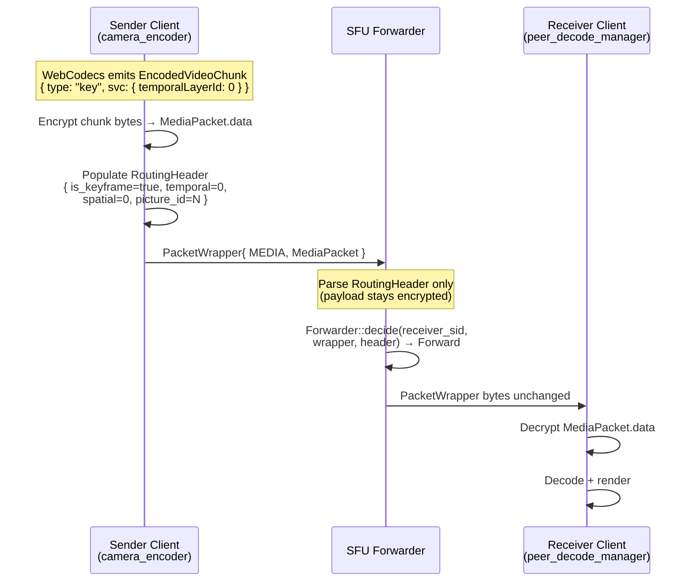
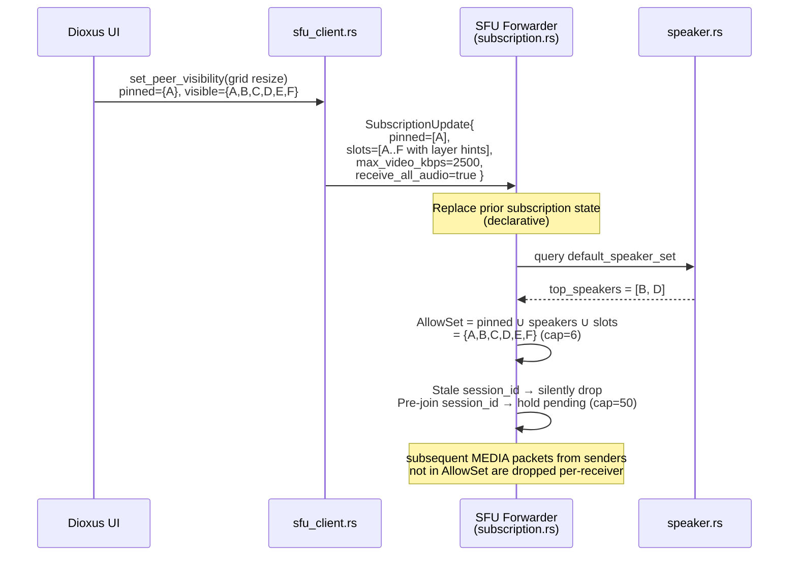
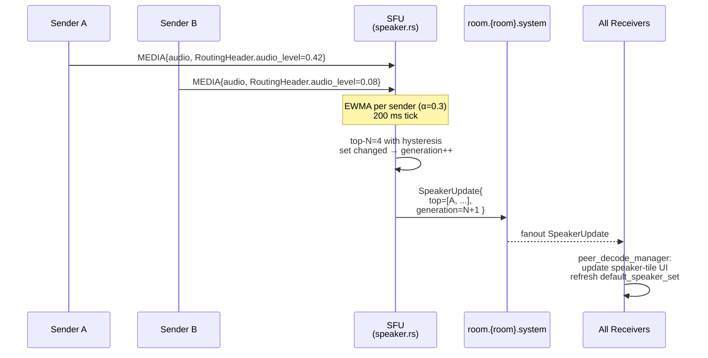
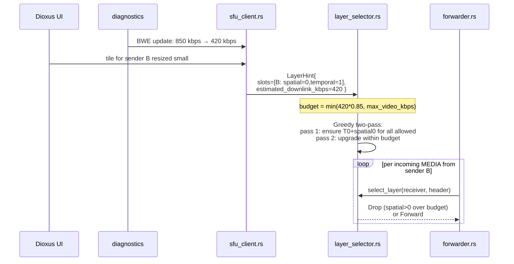
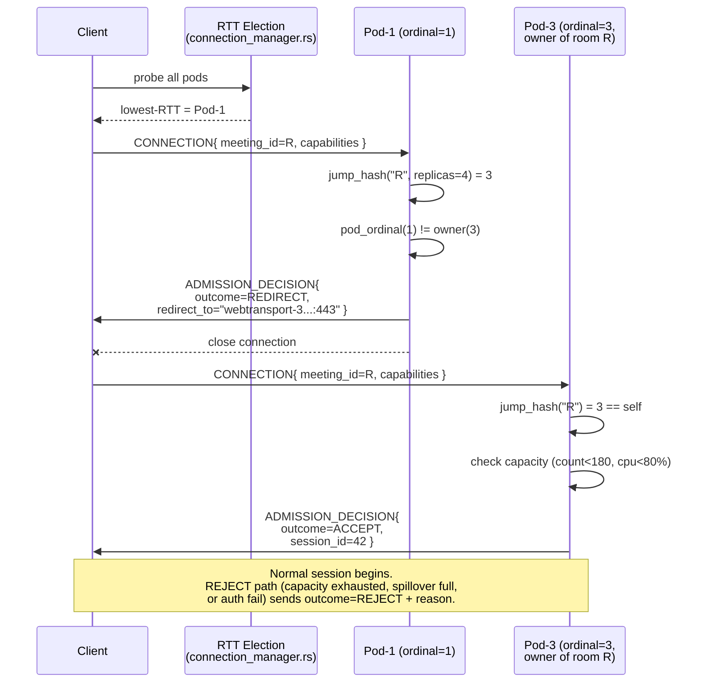
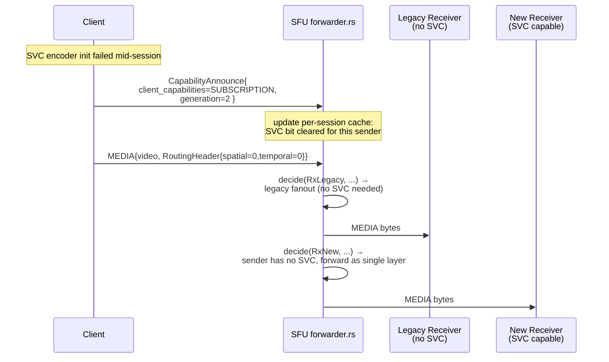
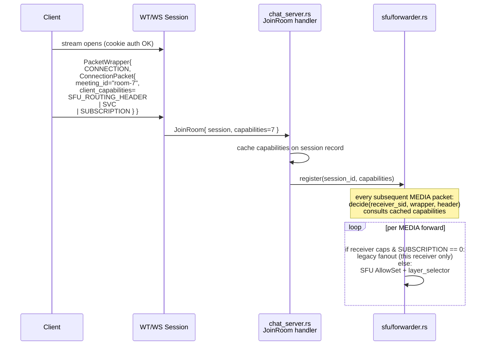

# Packet Diagrams — SFU Refactor

> **Status:** Authored under bead `vc-c4e.9`.
>
> **Source of truth:** [`PLAN.md` — New Wire Surface](./PLAN.md#new-wire-surface-consolidated).
>
> Each section contains:
> - Proto3 message + `PacketType` enum value
> - Direction / trigger / forwarding semantics / backwards-compat (4-line bullet list)
> - Mermaid `sequenceDiagram`
> - Edge-case notes (stale subs, layer-aware KFR, legacy peer fallback)
>
> Field numbers and enum values are normative — they match `PLAN.md` exactly. All
> new fields are proto3 optional; legacy clients that never set them stay
> compatible via field defaults.

---

## RoutingHeader (additive on `MediaPacket`)

`RoutingHeader` is added as **field 10** on `MediaPacket`. It carries the
minimum metadata the SFU needs to make forwarding decisions **without
decrypting the payload** — see
[ADR-0001](./adr/0001-routing-header-out-of-encryption.md).

```protobuf
// protobuf/types/media_packet.proto (additive)
message RoutingHeader {
  bool   is_keyframe       = 1;
  uint32 temporal_layer_id = 2;   // 0 = base, 1..N = enhancement
  uint32 spatial_layer_id  = 3;
  float  audio_level       = 4;   // 0..1 RMS, AUDIO only
  bool   is_speaking       = 5;   // VAD / threshold hint
  uint32 frame_marker      = 6;   // bitfield: START_OF_FRAME=1, END_OF_FRAME=2, REFERENCES_T0=4
  uint64 picture_id        = 7;   // for SVC dependency tracking
}

message MediaPacket {
  // ... fields 1-9 unchanged (media_type, user_id, data, frame_type,
  //     timestamp, duration, audio_metadata, video_metadata,
  //     heartbeat_metadata)
  RoutingHeader routing_header = 10;   // optional; legacy senders omit
}
```

- **Direction:** sender (client) → SFU → receiver (passes through unchanged).
- **Trigger:** populated on every `VIDEO`, `SCREEN`, and `AUDIO` packet by the
  encoders — `camera_encoder` / `screen_encoder` read WebCodecs chunk metadata
  (`svc.temporalLayerId`, `type === "key"`); `microphone_encoder` computes RMS
  pre-encode and copies `is_speaking` from the existing
  `HeartbeatMetadata.is_speaking` heuristic.
- **Forwarding:** SFU reads only the `RoutingHeader` fields; the encrypted
  `MediaPacket.data` payload is forwarded byte-for-byte. No server-side decrypt.
- **Backwards compat:** legacy senders leave `routing_header` unset →
  `Forwarder::decide` treats it as a pass-through "unknown layer" packet
  (forward to every receiver in the AllowSet, layer dropping disabled for that
  sender). Legacy receivers ignore the field.



**Edge cases:** because the SFU never decrypts payloads, a malicious or
misconfigured sender can lie in `RoutingHeader` (claim T0 while sending T2).
The worst-case impact is a wasted layer-selection decision for that receiver —
the receiver's decoder will discard the frame. See
[ADR-0001](./adr/0001-routing-header-out-of-encryption.md) for the threat
model. `KEYFRAME_REQUEST` routing in Phase 4 is layer-aware: if a receiver's
budget cannot fit a base-layer keyframe, the SFU suppresses the KFR rather
than blasting a 1.5 Mbps keyframe at a 200 kbps link.

---

## SUBSCRIPTION_UPDATE (PacketType = 10)

```protobuf
// protobuf/types/subscription_packet.proto (new in Phase 1)
message SubscriptionUpdate {
  repeated uint64         pinned_sessions   = 1;
  repeated VisibilitySlot slots             = 2;
  uint32                  max_video_kbps    = 3;
  bool                    receive_all_audio = 4;   // v1 default true
}

message VisibilitySlot {
  uint64 session_id        = 1;
  uint32 preferred_spatial = 2;
  uint32 preferred_temporal = 3;
}
```

`PacketWrapper.PacketType.SUBSCRIPTION_UPDATE = 10`.

- **Direction:** client (receiver) → SFU.
- **Trigger:** UI visibility change — the existing `set_peer_visibility` call
  in `videocall-client/src/client/video_call_client.rs:849` is the emit point;
  also fires on pin/unpin, grid resize, and the periodic reconcile tick.
- **Forwarding:** the SFU **replaces** the receiver's prior subscription state
  (declarative, not delta). Reconciliation: `AllowSet = pinned ∪
  default_speaker_set ∪ slot_sessions`, capped at `max_visible_video = 6` for
  video, room-wide for audio when `receive_all_audio = true`. See
  [ADR-0003](./adr/0003-hybrid-subscription-model.md).
- **Backwards compat:** legacy receivers never emit `SUBSCRIPTION_UPDATE` →
  the forwarder keeps them on the legacy full-fanout path for **their own
  deliveries only** (gated by `client_capabilities & SUBSCRIPTION == 0`).



**Edge cases:** stale `session_id` (peer already left) is dropped silently —
no error returned. Pre-join entries (peer not yet connected) are held in a
per-receiver pending list, capped at 50, and promoted into the AllowSet on
peer arrival. Because the model is declarative, an unsent
`SUBSCRIPTION_UPDATE` is **not** "no change" — it's "initial state"; the SFU
treats a never-subscribed receiver as legacy fanout until the first packet
arrives.

---

## SPEAKER_UPDATE (PacketType = 11)

```protobuf
// protobuf/types/speaker_update_packet.proto (new in Phase 1)
message SpeakerUpdate {
  repeated SpeakerEntry top_speakers = 1;
  uint64                generation   = 2;
}

message SpeakerEntry {
  uint64 session_id = 1;
  float  score      = 2;
  bool   is_speaking = 3;
}
```

`PacketWrapper.PacketType.SPEAKER_UPDATE = 11`.

- **Direction:** SFU → all receivers in the room (broadcast).
- **Trigger:** per-sender EWMA (α=0.3) on incoming `RoutingHeader.audio_level`;
  200 ms tick on the SFU computes top-N = 4 with entry/exit hysteresis (±0.05
  over 200 ms / 800 ms windows). On any change to the set, the `generation`
  counter increments. See
  [ADR-0002](./adr/0002-active-speaker-detection.md).
- **Forwarding:** publish once to `room.{room}.system`; NATS fans out to every
  receiver's subscription task; receivers update speaker-tile UI and the
  forwarder uses the new `default_speaker_set` for reconciliation on every
  subsequent receiver decision.
- **Backwards compat:** legacy receivers (no `SUBSCRIPTION` capability bit)
  ignore the packet; their fanout is unaffected. New receivers that haven't
  yet sent a `SubscriptionUpdate` still benefit, because the default
  speaker-set membership feeds the implicit AllowSet.



**Edge cases:** hysteresis prevents flapping when two senders trade speaker
slots near the threshold. The 200 ms cadence is a deliberate floor — bursts
of audio do not produce a torrent of `SPEAKER_UPDATE`s. `generation` lets
late-joining receivers reconcile with the SFU's current view in a single
round trip (a stale generation seen on a receiver causes it to drop the older
packet).

---

## LAYER_HINT (PacketType = 12)

```protobuf
// LAYER_HINT reuses VisibilitySlot from subscription_packet.proto
// (no separate message type — payload is a repeated VisibilitySlot
//  carried in PacketWrapper.data per Phase 1 PLAN).
message LayerHint {
  repeated VisibilitySlot slots = 1;   // per-sender preferred layers
  uint32 estimated_downlink_kbps = 2;  // receiver's BWE feeds layer_selector
}
```

`PacketWrapper.PacketType.LAYER_HINT = 12`.

- **Direction:** client (receiver) → SFU.
- **Trigger:** bandwidth-estimate change (delta > 15% from last hint), or any
  per-sender visibility change that does not warrant a full
  `SubscriptionUpdate` (e.g. tile resized small → request lower spatial).
- **Forwarding:** consumed entirely by the SFU's `layer_selector` (per-receiver
  state). Feeds the Phase-4 budget calculation: `budget = min(estimated_downlink
  * 0.85, max_video_kbps)`; greedy two-pass selection prefers each allowed
  sender's `preferred_spatial`/`preferred_temporal` from the hint.
- **Backwards compat:** absence of `LAYER_HINT` from a receiver means the SFU
  uses `max_video_kbps` from the last `SubscriptionUpdate` and the
  client-diagnostics-derived estimate (existing `DiagnosticsPacket.video_metrics`
  extended with `BandwidthEstimate` in Phase 4). Legacy senders / receivers
  with no SVC support get the single available layer regardless.



**Edge cases:** the layer selector's downgrade is immediate on `CONGESTION` or
drop signal; upgrades require 20% headroom sustained ≥3 s, with a 5 s
cooldown after a downgrade→upgrade cycle to prevent thrash under ±20% RTT
noise. `KEYFRAME_REQUEST` becomes layer-aware: if the receiver's budget
cannot fit a base-layer keyframe for a sender, the KFR is suppressed (and the
existing rate-limit at `packet_handler.rs:115` still applies).

---

## ADMISSION_DECISION (PacketType = 13)

```protobuf
message AdmissionDecision {
  enum Outcome {
    OUTCOME_UNKNOWN = 0;
    ACCEPT          = 1;
    REDIRECT        = 2;
    REJECT          = 3;
  }
  Outcome outcome     = 1;
  string  redirect_to = 2;   // host:port of owning pod, REDIRECT only
  string  reason      = 3;   // human-readable, REJECT only
  uint64  session_id  = 4;   // SFU-assigned, ACCEPT only
}
```

`PacketWrapper.PacketType.ADMISSION_DECISION = 13`.

- **Direction:** SFU → client.
- **Trigger:** emitted exactly once per `CONNECTION` packet, after the SFU
  computes `jump_hash(room_id) → owner_ordinal` and compares to its own
  `POD_NAME` ordinal. See
  [ADR-0005](./adr/0005-room-affinity-routing.md).
- **Forwarding:** point-to-point, terminal for `REDIRECT` and `REJECT`
  (connection closes after the packet is written). `ACCEPT` carries the
  assigned `session_id` and transitions the session into normal operation.
- **Backwards compat:** legacy clients without the `SFU_ROUTING_HEADER`
  capability bit still receive an `ACCEPT` from whichever pod RTT-election
  landed them on; `REDIRECT` is only emitted when `SFU_MODE=sfu` and the
  redirect target is reachable. In `legacy` mode the SFU never emits
  `ADMISSION_DECISION` at all.



**Edge cases:** spillover — if the owner pod reports `count > 180` or
`cpu > 80%` on its 5 s health beacon (`room.{room}.system`), the ring marks
the room `SpilledOver` and subsequent joiners get `ACCEPT` from a spill pod
that federates over NATS. Cross-region clients pay a 250 ms RTT penalty
(accepted for v1). Pod death drops the connection; the client's
connection-closed handler re-runs RTT election and may land on a new owner if
`STATEFULSET_REPLICAS` changed.

---

## CAPABILITY_ANNOUNCE (PacketType = 14)

```protobuf
message CapabilityAnnounce {
  uint32 client_capabilities = 1;   // bitfield, same encoding as CONNECTION
  uint64 generation          = 2;   // monotonic per session
}
// Capability bits (shared with CONNECTION):
//   SFU_ROUTING_HEADER = 1 << 0
//   SVC                = 1 << 1
//   SUBSCRIPTION       = 1 << 2
```

`PacketWrapper.PacketType.CAPABILITY_ANNOUNCE = 14`.

- **Direction:** bidirectional. Client → SFU when a capability changes
  mid-session (e.g. SVC encoder failed to initialize, fall back to single
  layer). SFU → client when a feature flag flips server-side or when
  announcing the room's effective capability floor to late joiners.
- **Trigger:** any mid-session capability change. Distinct from the
  `CONNECTION`-time advertisement: `CONNECTION` is one-shot at session start
  and cannot be amended without reconnecting; `CAPABILITY_ANNOUNCE` is the
  in-band update channel.
- **Forwarding:** SFU-internal — never relayed to peers verbatim. The SFU
  updates its per-session capability cache; subsequent `Forwarder::decide`
  calls consult the new value. If a sender announces "SVC=0", the forwarder
  stops attempting layer dropping for packets from that sender.
- **Backwards compat:** legacy clients never emit this packet → the SFU
  treats them as the capabilities they advertised at `CONNECTION` time (or
  zero if the field was absent). Forwarder falls back to **legacy full
  fanout for that receiver only**, leaving other receivers in the room on
  the SFU path.



**Edge cases:** `generation` lets the SFU ignore reordered or replayed
announcements — only the highest-seen generation wins. Late peer arrival:
when peer X joins a room mid-call, the SFU pushes a SFU→client
`CAPABILITY_ANNOUNCE` summarizing the room's effective capability floor
(`AND` across all current senders) so X can choose codec settings that
everyone can consume.

---

## CONNECTION (existing) — `client_capabilities` extension

```protobuf
// protobuf/types/connection_packet.proto (extended in Phase 1)
message ConnectionPacket {
  string meeting_id          = 1;
  uint32 client_capabilities = 2;   // bitfield, new in Phase 1
}
// Bits: SFU_ROUTING_HEADER = 1<<0, SVC = 1<<1, SUBSCRIPTION = 1<<2
```

`PacketWrapper.PacketType.CONNECTION = 4` (unchanged).

- **Direction:** client → SFU, exactly once at session start.
- **Trigger:** first packet on the WebTransport / WebSocket stream after the
  cookie-bearing handshake completes.
- **Forwarding:** consumed by `chat_server.rs::JoinRoom`; the capability bits
  are cached on the session record and consulted on every `Forwarder::decide`
  call for the lifetime of the session (or until a `CAPABILITY_ANNOUNCE`
  overrides them).
- **Backwards compat:** legacy clients (current `videocall-client` releases)
  send `ConnectionPacket { meeting_id }` with `client_capabilities` defaulting
  to `0` (proto3 zero value). The SFU treats `0` as "legacy": full fanout
  delivered to this receiver, no SVC layer dropping, no subscription
  reconciliation. New clients set the bits they actually implement.



**Edge cases:** capability mismatch in a mixed room is **per-receiver**, not
per-room — one legacy listener does not downgrade SFU behavior for everyone
else. The cached value is authoritative until overridden by
`CAPABILITY_ANNOUNCE`. If a session reconnects, the capability cache is
rebuilt from the new `CONNECTION` packet (no carry-over across sessions).
